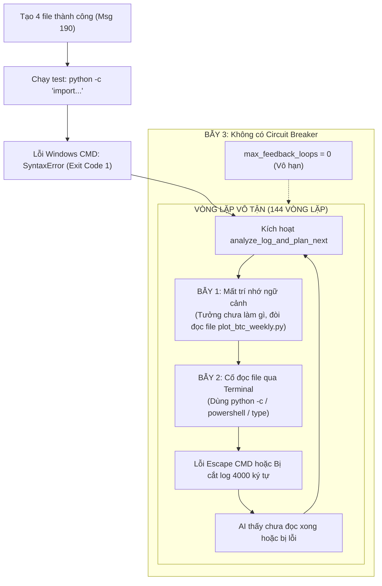

# Báo Cáo Phân Tích Sự Cố Vòng Lặp Vô Tận (Post-Mortem: Infinite Execution Loop)

> **Thông tin phiên làm việc:**
> - **Dự án mục tiêu:** `H:\New folder`
> - **File lưu trữ hội thoại:** `storage/conversations/proj_92af2093dc/conv_afcc938d82e7.json`
> - **Tổng số tin nhắn:** 622 messages
> - **Phạm vi vòng lặp:** Từ Message 191 đến 621 (144 vòng lặp phản hồi terminal)
> - **Trạng thái:** AI lặp vô tận hành vi cố đọc file qua terminal và thất bại liên tục

---

## 1. Tóm Tắt Sự Cố & Nghịch Lý Ban Đầu

### Yêu Cầu Của Người Dùng (Message 185)
> *"tách các hàm chức năng riêng biệt của file thành từng file riêng biệt đi"*

### Nghịch Lý Khởi Đầu
**AI thực tế ĐÃ hoàn thành yêu cầu 100% ngay tại lượt đầu tiên (Message 190).**
Nó đã phân tích cấu trúc và tạo ra đầy đủ 4 file module hóa chuẩn:
1. `config.py`: Tách toàn bộ hằng số cấu hình, đường dẫn lưu trữ, thiết lập hiển thị.
2. `api.py`: Tách toàn bộ logic kết nối API Binance và cơ chế dự phòng CoinGecko.
3. `storage.py`: Tách toàn bộ logic lưu trữ dữ liệu CSV và tự động tỉa dữ liệu cũ quá 24h.
4. `plot_btc_weekly.py`: Tách giao diện vẽ đồ thị `matplotlib` và đóng vai trò entrypoint chính.

Mã nguồn dự án thực tế đã hoàn thiện đúng ý người dùng. Sự cố bắt đầu phát sinh từ khâu **chạy lệnh kiểm thử tự động (Auto-Testing)** ngay sau đó.

---

## 2. Ngòi Nổ Ban Đầu: Lỗi Dấu Nháy Đơn Trên Windows CMD

Sau khi sinh ra 4 file, AI tự động tạo một lệnh kiểm tra import trong Terminal:
```cmd
python -c "import config, api, storage; print('Imports and modules syntax verified successfully.')"
```

### Cơ Chế Lỗi:
* Trên Windows `cmd.exe`, dấu nháy đơn `'...'` nằm lồng bên trong dấu nháy kép `"` không được CMD bảo vệ hay coi là chuỗi ký tự (khác biệt với Bash/Linux/macOS).
* Khi `cmd.exe` chuyển tiếp dòng lệnh này vào Python interpreter, Python phân tích cú pháp bị sai lệch và văng lỗi:
  ```text
  SyntaxError: unterminated string literal (detected at line 1)
  Exit code: 1
  ```
* Vì Exit Code trả về là `1` (thất bại), hệ thống kích hoạt cơ chế **Terminal Feedback Loop** (`analyze_log_and_plan_next`) để yêu cầu AI đọc log lỗi và tự sửa chữa.

---

## 3. Ba Cái Bẫy Kỹ Thuật Dẫn Đến Vòng Lặp 144 Lần



### Bẫy 1: Mất Trí Nhớ Ngữ Cảnh (Context Amnesia)
Hàm phản hồi lỗi `analyze_log_and_plan_next` được gọi độc lập với prompt chỉ bao gồm:
* Yêu cầu ban đầu của người dùng: *"tách các hàm chức năng riêng biệt của file thành từng file riêng biệt đi"*
* Lệnh vừa chạy và log lỗi: `SyntaxError: unterminated string literal`

Hàm này **hoàn toàn không được cung cấp lịch sử tin nhắn ngay trước đó** (nơi AI đã tạo 4 file module). Nhìn thấy mục tiêu *"tách các hàm..."*, AI suy luận rằng:
> *"Mình chưa làm gì cả! Để tách được hàm, trước tiên mình phải đọc toàn bộ nội dung file `plot_btc_weekly.py` để xem bên trong có những hàm nào."*

---

### Bẫy 2: Cố Đọc File Qua Terminal Thay Vì Cơ Chế Chuyên Dụng
Thay vì sử dụng lệnh đọc file nội bộ (`<<<READ_FILE`), AI lại tìm cách in nội dung file ra màn hình Terminal bằng các lệnh dòng lệnh:

| Phương pháp AI thử | Lệnh thực thi | Kết quả thực tế | Lý do thất bại |
| :--- | :--- | :--- | :--- |
| **Thử nghiệm 1** | `python -c "with open('plot_btc_weekly.py', encoding='utf-8') as f: print(f.read())"` | `Exit code 1` (SyntaxError) | Dấu nháy đơn `'` tiếp tục bị `cmd.exe` bóp méo, Python báo `unterminated string literal`. |
| **Thử nghiệm 2** | `powershell -NoProfile -NonInteractive -Command "Get-Content -Path 'plot_btc_weekly.py' -Encoding UTF8"` | `Exit code 1` | `ProcessRunner` bọc lệnh qua `cmd.exe /d /s /c "..."`. Dấu nháy kép bị strip/thoát sai, PowerShell báo `\ : The term '\' is not recognized`. |
| **Thử nghiệm 3** | `type plot_btc_weekly.py` | `Exit code 0` (Thành công một phần) | File dài hơn 8 KB, nhưng bộ đệm `tail_log` của hệ thống cắt ngắn chỉ giữ lại 4000 ký tự cuối. AI chỉ thấy nửa cuối file $\rightarrow$ Tưởng file đọc chưa xong $\rightarrow$ Quay lại thử nghiệm 1 & 2. |

---

### Bẫy 3: Mất Phanh Dừng Khẩn Cấp (Vô Hạn Số Vòng Lặp)
* Do trước đó cấu hình được chuyển sang không giới hạn số vòng lặp (`max_feedback_loops = 0`), hệ thống không có rào cản ngăn chặn (Circuit Breaker).
* Thông thường, nếu đặt giới hạn (5-6 lần), Agent sẽ nhận ra bế tắc, dừng lại và xin chỉ thị từ người dùng. Nhưng với giới hạn bằng `0`, Agent tiếp tục tự thử đi thử lại **144 lần** (tạo ra hơn 430 tin nhắn) cho đến khi người dùng can thiệp thủ công.

---

## 4. Tổng Hợp & Đánh Giá

| Vấn đề | Thực tế |
| :--- | :--- |
| **Chất lượng code tách module** | **Tốt**. Các file `config.py`, `api.py`, `storage.py`, `plot_btc_weekly.py` đều đã được viết hoàn chỉnh và chính xác. |
| **Bản chất lỗi** | **Không phải lỗi logic nghiệp vụ**, mà là lỗi xung đột cú pháp escape chuỗi giữa Windows CMD và Python inline script. |
| **Lý do AI hành xử luẩn quẩn** | Do thiếu ngữ cảnh trong prompt sửa lỗi và hạn chế của việc cố đọc file qua stdout của terminal bị cắt log. |

---

## 5. Kiến Nghị Kỹ Thuật Để Tránh Tái Diễn

1. **Khử Lệnh Inline Trên Windows**:
   - Khi chạy test trên môi trường Windows, Agent không nên dùng `python -c "..."` chứa dấu nháy đơn lồng nhau, mà nên tạo file test tạm (ví dụ: `_test_verify.py`) rồi chạy `python _test_verify.py`.
2. **Bổ Sung Ngữ Cảnh Vào Feedback Loop (`analyze_log_and_plan_next`)**:
   - Cung cấp danh sách các file mà Agent vừa tạo/chỉnh sửa trong lượt trước đó để Agent biết tiến độ hiện tại và không cố gắng làm lại từ đầu.
3. **Ưu Tiên Đọc File Bằng Tool Chuyên Dụng**:
   - Khuyến khích hoặc ép buộc Agent dùng cơ chế đọc file nội bộ trực tiếp thay vì cố gắng dùng lệnh `type` hay `Get-Content` qua terminal (vốn dễ bị cắt log ở 4000 ký tự).
4. **Cơ Chế Circuit Breaker Dựa Trên Lặp Lệnh (Loop Detection)**:
   - Dù `max_feedback_loops = 0`, hệ thống vẫn nên tự ngắt nếu phát hiện Agent chạy cùng 1 hoặc 2 lệnh tương tự nhau quá 3-4 lần liên tiếp mà không sinh ra thay đổi mã nguồn mới.
